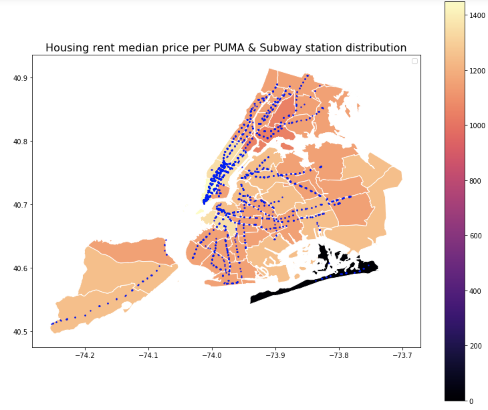

# HW11
## All done by myself

## Assignment 1
Time series (ARMA) + Random Forest Classificaiton  deal with subway dataset.
Data structure: 600  stations * 23 ride card types * 194 weeks 
https://github.com/jingxiaorobin/PUI2018_xj655/raw/master/HW11_xj655/HW11_subway_timeseries_xj655.ipynb

## Assignment 2
HW8 Revised
 > What I revised:
 
I removed the data of median rent less than 100 which is an outlier for the plot, improving the deliverable of the plot message.

> Improve Result:

Make the geoplot color more diverse by district.
## Improved Plot

The graph demonstrates the housing median rent cost by PUMA in NYC. THe darker means lower rent per unit and the ligher yellow means higher rent per unit. It shows that in downtown the denser the stations are ,the higher the cost is. However, when the area is far away from downtown, the price have less correlation with station density.
## Original Plot

