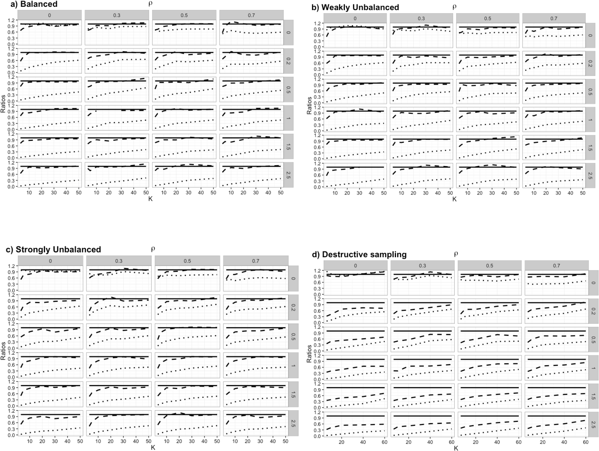

Assingment2 Essay-Test)
Author:Xiao Jing(xj655), Yaxuan Ying(yy2908)

| **Statistical Analyses**    |  **IV(s)**  |  **IV type(s)** |  **DV(s)**  |  **DV type(s)**  |  **Control Var** | **Control Var type**  | **Question to be answered** | **_H0_** | **alpha** | **link to paper**| 
|:----------:|:----------|:------------|:-------------|:-------------|:------------|:------------- |:------------------|:----:|:-------:|:-------|
ANCOVA|Whether take the  one of component in hormone called Rosiglitzone|Categorical|Fasting glucose( 2 hour glucose on oral glucose tolerance test)
visceral adipose tissue(VAT) volume
subcutaneous adipose tissue (SAT) volume|All are Continuous |Age;
Recombinant human growth hormone (rhGH)
concomitant medication(including Fibrate, statin, Fish oil and other 2 components)(5)
antropomet-ric(including weight, height and other 4 indicators)(6)|"1:categorical 
2:categorical
3~8:continuous 9~15:continuous"|Do fasting glucose volume(/VAT/SAT) value of HIV infector group taking Rosiglitzone significantly lower  than control HIV infector group|Fasting glucose volume of test groups >= Ranks control group|Alpha = 0.05|[Recombinant Human Growth Hormone and Rosiglitazone for Abdominal Fat Accumulation in HIV-Infected Patients with Insulin Resistance: A Randomized, Double-Blind, Placebo-Controlled, Factorial Trial](https://journals.plos.org/plosone/article/file?id=10.1371/journal.pone.0061160&type=printable)
|Path Analysis|women age (X1), place of residence (X2), religion (X3), socioeconomic status (X4), use of family planning methods (X5), women education (X6), age at first marriage (X7) and unwanted births (X8)|Continuous
and Categorical|women education (X6), age at first marriage (X7) 
unwanted births (X8)|Continuous|"pregnancy occurred within 5 years "|categorical|Find what are the direct factors and what are the indirect factors to influence the dependent variable X8 unwanted births.(The endogenous direct variables {X6,X7,X8} exist.)|1. X1,X2,X3,X4,X5 has no correlation with X6. The coefficients for (X6~X1+X2+X3+X4+X5) are not exist. 
Beta(6)=0
2. X1,X2,X3,X4,X5,X6 has no correlation with X7. The coefficients for (X7~X1+X2+X3+X4+X5+X6) are not exist.
Beta(7)=0
3. Same with X8|Alpha = 0.01|"Correlates of Unwanted Births in Bangladesh: [A Study through
Path Analysis ](https://journals.plos.org/plosone/article/file?id=10.1371/journal.pone.0164007&type=printable")|
Logistic Regression|30 , number of clusters|Categorical|500,field observations(scenarios)| Continuous|the strength and source of correlation|categorical|determine how clustering rules in GEE affect their ability to decrease the statistical bias in variance estimation due to correlation in longitudinal data|The robust estimate of variance becomes unbiased when the number of independent clusters is higher than 20.|Alpha = 0.05|[Robust Inference from Conditional Logistic Regression Applied to Movement and Habitat Selection Analysis](https://journals.plos.org/plosone/article?id=10.1371/journal.pone.0169779)|

